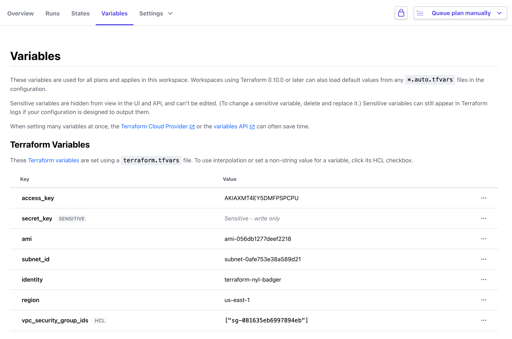

# Lab 11: Terraform Cloud (Optional)
This is an optional lab for students using Terraform Cloud/Terraform Enterprise.  It uses the [Terraform Cloud Remote Backend](https://app.terraform.io/signup?utm_source=banner&utm_campaign=intro_tf_cloud_remote).

Duration: 10 minutes
- Task 1: Sign up for Terraform Cloud
- Task 2: Update your Terraform configuration to use the remote backend
- Task 3: Migrate Local Terraform State & Variables dto Terraform Cloud/Terraform Enterprise

## Task 1: Sign up for Terraform Cloud

### Step 11.1.1

Navigate to [the sign up page](https://app.terraform.io/signup?utm_source=banner&utm_campaign=intro_tf_cloud_remote) and create an account for Terraform Cloud.

Provide your instructor with the email address that you created an account with.

### Step 11.1.2

Terraform's CLI needs credentials before it can access Terraform Cloud. Follow these steps to allow Terraform to access your organization.

1. Login to TFE and click the "+ New Workspace" button.
2. In the **Choose Your Workflow** section, click the "CLI-driven workflow" button.
3. Enter the name `training-<INITIALS>-dev` for the Workspace and select "Create Workspace"
4. Follow the steps under the **CLI-driven runs** section by performing a `terraform login` and creating a `backend.tf` file with the example code provided in your workspace.

### Step 11.1.3

Terraform's CLI needs credentials before it can access Terraform Cloud. We will leverage the `terraform login` command to perform our login to TFC.

```bash
terraform login

Terraform will request an API token for app.terraform.io using your browser.

If login is successful, Terraform will store the token in plain text in
the following file for use by subsequent commands:
    /home/nyl/.terraform.d/credentials.tfrc.json

Do you want to proceed?
  Only 'yes' will be accepted to confirm.

  Enter a value: yes


---------------------------------------------------------------------------------

Open the following URL to access the tokens page for app.terraform.io:
    https://app.terraform.io/app/settings/tokens?source=terraform-login


---------------------------------------------------------------------------------

Generate a token using your browser, and copy-paste it into this prompt.

Terraform will store the token in plain text in the following file
for use by subsequent commands:
    /home/nyl/.terraform.d/credentials.tfrc.json

Token for app.terraform.io:
  Enter a value: 


Retrieved token for user gabe_maentz


---------------------------------------------------------------------------------

Success! Terraform has obtained and saved an API token.

The new API token will be used for any future Terraform command that must make
authenticated requests to app.terraform.io.

```


## Task 2: Update your remote backend in the your Terraform config

### Step 11.2.1

Navigate to directory containing your `main.tf` where we created our resources for this training. Create a `backend.tf` file using the example code provided by Terraform Cloud/Enterprise.


```shell
terraform {
  backend "remote" {
    organization = "Enterprise-Cloud"

    workspaces {
      name = "training-ghm-dev"
    }
  }
}
```

Replace the organization with the name you chose in the previous step.

### Step 11.2.2

Run `terraform init`.

```shell
> terraform init
Initializing the backend...
Do you want to copy existing state to the new backend?
  Pre-existing state was found while migrating the previous "local" backend to the
  newly configured "remote" backend. No existing state was found in the newly
  configured "remote" backend. Do you want to copy this state to the new "remote"
  backend? Enter "yes" to copy and "no" to start with an empty state.

  Enter a value:
```

Answer `yes` to move state to Terraform Cloud.


## Task 3: Migrate Local Terraform State & Variables to Terraform Cloud/Terraform Enterprise

### Step 11.3.1

Validate that state has been succesfully migrated by running a `terraform show`

```
nyl@terraform-nyl-badger:/workstation/terraform > terraform show
# aws_instance.web:
resource "aws_instance" "web" {
    ami                          = "ami-056db1277deef2218"
    arn                          = "arn:aws:ec2:us-east-1:508140242758:instance/i-041b3a45e1a2dee1f"
    associate_public_ip_address  = true
    availability_zone            = "us-east-1b"
    cpu_core_count               = 1
    cpu_threads_per_core         = 1
    disable_api_termination      = false
    ebs_optimized                = false
    get_password_data            = false
    hibernation                  = false
    id                           = "i-041b3a45e1a2dee1f"
    instance_state               = "running"
    instance_type                = "t2.micro"
    ipv6_address_count           = 0
    ipv6_addresses               = []
    monitoring                   = false
    primary_network_interface_id = "eni-075ae77924adfc764"
    private_dns                  = "ip-10-1-2-152.ec2.internal"
    private_ip                   = "10.1.2.152"
    public_dns                   = "ec2-3-236-31-143.compute-1.amazonaws.com"
    public_ip                    = "3.236.31.143"
...
```

### Step 11.3.2
Connect to your workspace inside TFE and browse to the `States` tab.  You should see that your state file has succesfully been migrated.


### Step 11.3.3

After validating the migration run a `terraform plan` and you should notice that Terraform does not by default remove the local state file that was migrated.  This is to ensure that you are comfortable with the migration and if you are will need to remove the local *.tfstate file manually.

```bash
Running plan in the remote backend. Output will stream here. Pressing Ctrl-C
will stop streaming the logs, but will not stop the plan running remotely.

Preparing the remote plan...

To view this run in a browser, visit:
https://app.terraform.io/app/Enterprise-Cloud/server-build/runs/run-iFXAhxKR7ketE85H

Waiting for the plan to start...

Terraform v0.14.8

------------ Terraform Cloud System Message ------------

Terraform Cloud detected a terraform.tfstate file in your working
directory: ./terraform.tfstate

The presence of this file causes a state migration error which prevents
Terraform from running successfully. To fix this error please migrate
your local terraform.tfstate to Terraform Cloud and make sure the
the file is deleted.

For step by step instructions on how to migrate your terraform.tfstate
file from Terraform Open Source to Terraform Cloud, please see:

   https://www.terraform.io/docs/enterprise/migrate/index.html

--------------------------------------------------------

Setup failed: Terraform Cloud detected a terraform.tfstate file
```

```bash
rm terraform.tfstate*
```

### Step 11.3.4 - Set Variables in Terraform Cloud / Enterprise

Once deleted you can rerun `terraform plan`.  You will notice that because we are now connected to Terraform Cloud / Terraform Enterprise we will need to also move our variable definitions to the `Variables` section.

```bash
nyl@terraform-nyl-badger:/workstation/terraform > terraform plan
Running plan in the remote backend. Output will stream here. Pressing Ctrl-C
will stop streaming the logs, but will not stop the plan running remotely.

Preparing the remote plan...

To view this run in a browser, visit:
https://app.terraform.io/app/Enterprise-Cloud/training-ghm-dev/runs/run-X7ZA8XrH2TEN7fCY

Waiting for the plan to start...

Terraform v0.14.9
Configuring remote state backend...
Initializing Terraform configuration...

Error: No value for required variable

  on main.tf line 21:
  21: variable "access_key" {}

The root module input variable "access_key" is not set, and has no default
value. Use a -var or -var-file command line argument to provide a value for
this variable.


Error: No value for required variable

  on main.tf line 22:
  22: variable "secret_key" {}

The root module input variable "secret_key" is not set, and has no default
value. Use a -var or -var-file command line argument to provide a value for
this variable.
```

These var



### Step 11.3.4

Once the variables have been set in Terraform Cloud / Enterprise run a `terraform plan`.

```
nyl@terraform-nyl-badger:/workstation/terraform > terraform plan
Running plan in the remote backend. Output will stream here. Pressing Ctrl-C
will stop streaming the logs, but will not stop the plan running remotely.

Preparing the remote plan...

To view this run in a browser, visit:
https://app.terraform.io/app/Enterprise-Cloud/training-ghm-dev/runs/run-82ZV5k6Moy13kjzd

Waiting for the plan to start...

Terraform v0.14.9
Configuring remote state backend...
Initializing Terraform configuration...
aws_instance.web: Refreshing state... [id=i-041b3a45e1a2dee1f]

No changes. Infrastructure is up-to-date.

This means that Terraform did not detect any differences between your
configuration and real physical resources that exist. As a result, no
actions need to be performed.
```

### Step 11.3.5

Congratulations! You're now storing state and your variables centrally with Terraform Cloud you are able to share your workspace with teammates. Back in the Terraform Cloud UI you'll be able to:

* View all your organization's workspaces
* Lock a workspace, making it easy to avoid conflicting changes and state corruption
* View state history
  

### Step 11.3.6

Create a new tag and run `terraform apply` and go to the Workspace you created. You should see state information there.

For more information on Terraform Cloud, check out the [Learn site](https://learn.hashicorp.com/terraform/?track=cloud#cloud).